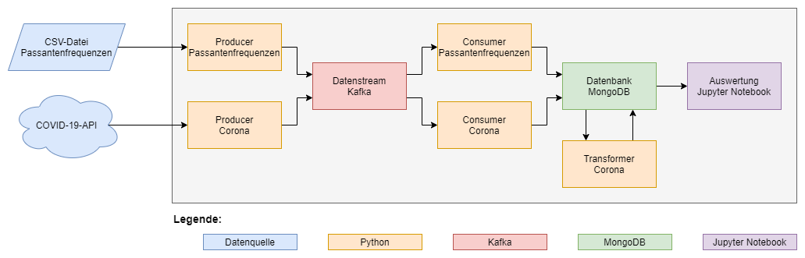
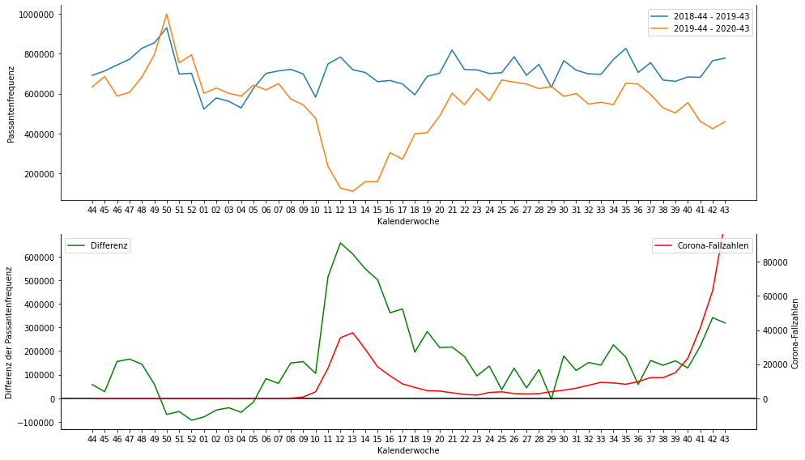
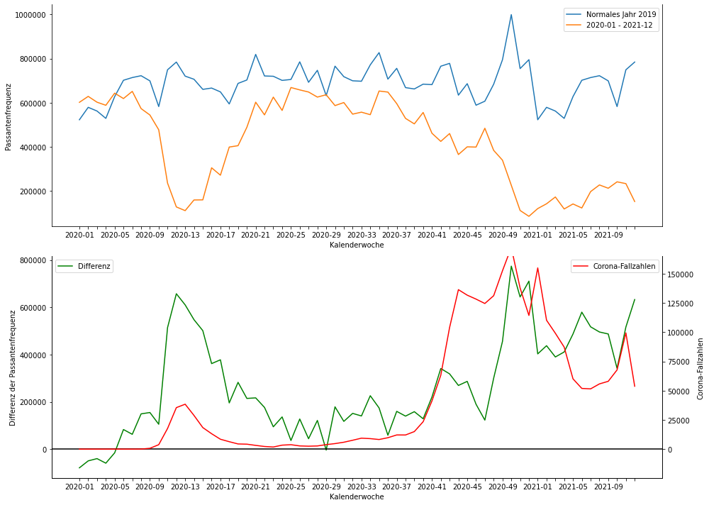

# Korrelationsanalyse zwischen den Corona-Fallzahlen und den Passantenaufkommen in deutschen Großstädten

**Ein Projekt von**

| Nachname | Vorname | Matrikelnummer |
| -------- | ------- | -------------- |
| Grohmann | Tim     | xxx            |
| Kaufmann | Niclas  | xxx            |

**Im Kurs *Big Data Analytics***

**an der *Dualen Hochschule Baden-Württemberg Mannheim*.**

## Inhaltsverzeichnis

  - [1. Aufgabenstellung](#1-aufgabenstellung)
  - [2. Datenquellen](#2-datenquellen)
    - [2.1. Passantenfrequenzen](#21-passantenfrequenzen)
    - [2.2. Coronafallzahlen](#22-coronafallzahlen)
  - [3. Umsetzung](#3-umsetzung)
    - [3.1. Lösungsarchitektur](#31-lösungsarchitektur)
    - [3.2. Importieren der Daten in die Datenbank mit Kafka](#32-importieren-der-daten-in-die-datenbank-mit-kafka)
    - [3.3. Transformation der Corona-Fallzahlen](#33-transformation-der-corona-fallzahlen)
    - [3.4. Auswertung](#34-auswertung)
  - [4. Fazit](#4-fazit)

## 1. Aufgabenstellung

*von Niclas Kaufmann*

In diesem Projekt soll untersucht werden, ob in Deutschland eine Korrelation zwischen den Corona-Fallzahlen und den Passantenaufkommen in Fußgängerzonen existiert. Die Fallzahlen gelten für die gesamte Bundesrepublik Deutschland und die Daten für die Passantenfrequenzen stammen aus zentralen Fußgängerzonen in deutschen Großstädten.

Es soll ein Arbeitsablauf geschrieben werden, der sowohl ein *Extract, Load, Transform* (ELT)-Prozess als auch eine Auswertung abbildet:
1. Die Daten werden aus den beiden Datenquellen extrahiert.
2. Die extrahierten Datenquellen sollen in die Datenbank geladen werden.
3. Die Corona-Fallzahlen müssen noch transformiert werden, damit sie ausgewertet werden.
4. Anschließend soll eine Auswertung geschrieben werden, die die Daten aus der Datenbank liest und ein anschauliches Diagramm erstellt.


Am Ende dieser Arbeit soll die Auswertung gedeutet und die Frage geklären werden, ob in Deutschland eine Korrelation zwischen den Corona-Fallzahlen und den Passantenaufkommen existiert und wie diese ausfällt.

## 2. Datenquellen

In dem Projekt werden insgesamt zwei Datenquellen verwendet, welche im Folgenden näher erläutert werden sollen.

### 2.1. Passantenfrequenzen

*von Tim Grohmann*

Daten über die Passentenfrequenzen in deutschen Innenstädten werden von *hystreet.com*, einer Initiative der Aachener Grundvermögen, erhoben und sind bis zu stundengenau von ebendieser Website als CSV-Dateien frei herunterladbar.

Für dieses Projekt war ein großer Abdeckungszeitraum der Datenquellen wichtig, da der Zeitraum von Oktober 2018 - September 2019 mit dem Zeitraum Oktober 2019 - Septeber 2020 verglichen wird.
Deshalb kommen viele Messpunkte von *hystreet* nicht in Frage, da diese erst nach Oktober 2018 installiert wurden.
Um ein möglichst aussagekräftiges Ergebnis zu erhalten, wurden für die Auswertung 4 Messpunkte miteinander kombiniert:

- Frankfurt/M, Goethestraße
- Frankfurt/M, Große Bockenheimer Straße
- Düsseldorf, Königsallee
- Stuttgart, Königstraße

So soll verhindert werden, das einzelne lokale Ereignisse (Demonstation, Stadtfest, etc.) zu großen Ausreißern in den Daten führen.

Da die Fluktuation von Passantenzahlen während eines Tages für diese Betrachtung irrelevant sind, wurden nur tagesgenaue CSVs von hystreet exportiert. Die Datensätze in diesen CSV-Dateien sind wie folgt strukturiert.

| Spalte                  | Bedeutung                                                      |
| ----------------------- | -------------------------------------------------------------- |
| **location**            | Standort der Messung, in einer Datei jeweils gleich            |
| **time of measurement** | Zeitpunkt der Messung, jeweils 00.00 Uhr des betroffenen Tages |
| weekday                 | Wochentag der Messung                                          |
| **pedestrians count**   | Anzahl der Fußgänger an diesem Tag                             |
| temperature in ºc       | Temperatur im Messzeitraum                                     |
| weather condition       | Wetterverhältnisse im Messzeitraum                             |
| incidents               | besondere Vorkommnisse (Sensorausfall o.ä.)                    |

Die für diese Auswertung relevanten Spalten wurden **fett** markiert.

### 2.2. Coronafallzahlen

*von Niclas Kaufmann*

Die täglichen Corona-Fallzahlen für Deutschland werden von der COVID 19 API (https://covid19api.com/) bereitgestellt. Diese Daten stammen von dem *Coronavirus Resource Center* der Johns Hopkins University in Maryland.

Die API unterstützt verschiedene Endpunkte, um Daten zu den Fallzahlen abzufragen. Die kostenlose Variante benötigt keinen API-Schlüssel, um auf die Daten zuzugreifen. Für das Projekt wird der Endpunkt `/dayone/country/:country/status/confirmed` verwendet. Dieser Endpunkt gibt für jeden Tag nach der ersten Aufzeichnung die Fallzahlen zurück, die bestätigt sind. Für Deutschland (`country := 'germany'`) werden also alle Tage, ab dem 27. Januar 2020 zurückgegeben.

Zurückgegeben wird ein JSON-Array, welches für jeden Tag ein Objekt mit folgendem Schema enthält:
```json
  {
    "Country": "string",
    "CountryCode": "string",
    "Province": "string",
    "City": "string",
    "CityCode": "string",
    "Lat": "string",
    "Lon": "string",
    "Cases": "number",
    "Status": "string",
    "Date": "string"
  }
```
Für Deutschland sind die Eigenschaften von `Province`, `City` und `CityCode` nicht ausgefüllt, bzw. ein leerer String, da die Daten für ganz Deutschland abgefragt werden und nicht für einzelne Städte oder Bundesländer. Die `Cases` sind die summierten Fallzahlen für das jeweilige Land, unabhängig, ob der Mensch das Virus überwunden hat oder nicht. Das Attribut `Date` ist ein UTC-konformer String.

Als Beispiel soll das Objekt für den 22. Juli 2020 (generiert am 05. November 2020) gezeigt werden:
```json
  {
      "Country": "Germany",
      "CountryCode": "DE",
      "Province": "",
      "City": "",
      "CityCode": "",
      "Lat": "51.17",
      "Lon": "10.45",
      "Cases": 204276,
      "Status": "confirmed",
      "Date": "2020-07-22T00:00:00Z"
  }
```


## 3. Umsetzung

### 3.1. Lösungsarchitektur
*von Niclas Kaufmann*

In dem nachfolgendem Schema soll die Lösungsarchitektur dargestellt werden:



Die beiden Producer importieren die Datenquellen und senden sie als Nachrichten an Apache Kafka, welches eine Open-Source-Anwendung zur Verarbeitung von Datenströmen ist.

Die Consumer abonnieren auf ein Topic im Kafka-Server und erhalten danach alle eingespielten Nachrichten der Producer auf das Topic. Anschließend laden die Consumer die einzelnen Nachrichten in die MongoDB als Dokumente. MongoDB ist eine dokumentenorientierte NoSQL-Datenbank.

Sind die Daten in die MongoDB importiert, müssen die Corona-Fallzahlen noch transformiert werden. Die Fallzahlen liegen als kumulierte Werte vor, es werden aber die täglichen neuen Fallzahlen benötigt. Diese Transformation wird von einem Python-Skript durchgeführt.

Anschließend wird die Auswertung der Daten in einem Jupyter Notebook ausgeführt, das die Daten aus der MongoDB lädt. Jupyter Notebook ist eine web-basierte interaktive Python-Umgebung.


### 3.2. Importieren der Daten in die Datenbank mit Kafka
*von Niclas Kaufmann*

Die Datenquellen (beschrieben in Kapitel 2) werden mit Hilfe von Kafka in die Datenbank geladen. Zuerst lädt der Producer die Datenquelle und sendet die einzelnen Daten an ein bestimmtes Topic des Kafka Senders. Der Consumer abonniert auf dieses Topic. Wichtig ist, dass der Consumer nur Nachrichten des Producers beachtet, die nach dem Abonnement gesendet werden.
Die verschiedenen Producer und Consumer für die Passantenfrequenzen und Corona-Fallzahlen werden im Folgenden beschrieben.

#### **Producer für Passantenfrequenzen**
*von Tim Grohmann*

Die Passentenfrequenzen werden aus mehreren CSV-Dateien ausgelesen, deren relative Dateipfade in einem Array angegeben werden können.

```python
import kafka

producer = kafka.KafkaProducer()

paths = [
    'data/frankfurt a.m.-goethestraße-20180930-20201031-day.csv',
    'data/stuttgart-königstraße (mitte)-20180930-20201031-day.csv',
    'data/düsseldorf-königsallee ostseite (süd)-20180930-20201031-day.csv',
    'data/frankfurt a.m.-große bockenheimer straße-20180930-20201031-day.csv'
]
```

Aus jeder dieser Datei wird nun Zeile für Zeile gelesen (die Kopfzeile muss dabei übersprungen werden) und der Inhalt jeder Zeile als UTF-8-kodierter String an das Kafka-Topic `peoplecount` gesendet.

```python
for path in paths:
    dataset = open(path, encoding='utf-8')
    lines = dataset.readlines()[1:]

    for i, line in enumerate(lines):
        print(line)
        producer.send('peoplecount', value=bytearray(line, encoding='utf-8'))
```

#### **Consumer für Passantenfrequenzen**
*von Tim Grohmann*

```python
import kafka
import datetime as dt
from pymongo import MongoClient

# Verbindung mit Kafka für Topic 'peoplecount'
consumer = kafka.KafkaConsumer('peoplecount')

# Verbindung mit Mongo-Server für Collection 'peoplecount'
client = MongoClient()
pp = client['bigdata']['peoplecount']

# Löschen bereits vorhandener Daten, damit keine Duplikate beim mehrfachen Ausführen entstehen
pp.delete_many({})

# Initialisieren eines leeren Dictionairies, in das später Werte für moving average abgelegt werden
sums = {}
```

Im entsprechenden Consumer werden diese Daten wieder zurück in einen String konvertiert und nach dem Trennzeichen `;` aufgesplittet. Eine einzelne Zeile aus der CSV-Datei ist jetzt also als Array von Strings vorhanden.

```python
for message in consumer:
    values = message.value.decode('utf-8').split(';')
    place = values[0]

    count = int(values[3])
    if count == 0:
        if place not in sums:
            continue
        else:
            val = sums[place]
            # calculate moving average
            count = round(float(val['total'])/val['count'])
    else:
        if place not in sums:
            sums[place] = {'count': 1, 'total': count}
        else:
            sums[place]['count'] += 1
            sums[place]['total'] += count

    pp.insert_one({
        'day': dt.datetime.strptime(values[1][:-6],"%Y-%m-%d %H:%M:%S"),
        'count': count,
    })
```

In den Datensätzen sind einige Tage vorhanden, an denen 0 Fußgänger gezählt werden. Das ist äußerst unwahrscheinlich und demzufolge auf eine Systemstörung zurückzuführen.
Damit diese fehlerhaften Datensätze die Analyse nicht verfälschen, werden sie im Consumer mit dem *moving average* des jeweiligen Standortes aufgefüllt.
Dazu werden in einem Dictionary `sums` mit dem Namen des Standorts als Schlüssel ein weiteres Dictionary abgelegt, das zum einen die Menge gezählter Tage (`count`) und zum anderen die kumulative Personenzahl (`total`) enthält.
Sollte im Consumer nun ein Datensatz mit einer vemeintlichen Personenzahl von 0 gelesen, wird nicht diese 0 in die Datenbank geschrieben, sondern der bisherige Durchschnitt `total / count`.

#### **Producer für Corona-Fallzahlen**
*von Niclas Kaufmann*

Der Producer für die Corona-Fallzahlen ist in der Python-Datei `producer-corona.py` implentiert und hat den folgenden Aufbau (die Print-Befehle wurden der Übersichthalber entfernt): 

```python
import kafka
import requests
import json

json_data = requests.get(url='https://api.covid19api.com/dayone/country/germany/status/confirmed').json()

producer = kafka.KafkaProducer()

for i, line in enumerate(json_data):
    producer.send('corona', value=bytearray(json.dumps(line), encoding='utf-8'))
```

Zuerst wird ein HTTP-Request an die COVID 19 API gestellt, der die Corona-Fallzahlen abfragt. Als nächstes wird ein Producer initialisiert. Da der Kafka-Server auf der Standard-Adresse `localhost:9092` läuft, muss sie nicht weiter angegeben werden. Der Producer sendet für jedes Objekt des JSON-Arrays einen geparsten String an das Topic `corona`.

#### **Consumer für Corona-Fallzahlen**
*von Niclas Kaufmann*

In der Datei `consumer-corona.py` wird der Consumer für die Corona-Fallzahlen implementiert. Im Folgenden wird der Inhalt der Datei gezeigt (die Print-Befehle wurden der Übersichthalber entfernt):

```py
import kafka
from pymongo import MongoClient
import json
from datetime import datetime

consumer = kafka.KafkaConsumer('corona')

client = MongoClient()
collection = client['bigdata']['corona-deutschland']
collection.delete_many({})

for message in consumer:
    values = json.loads(message.value.decode('utf-8'))
    try:
        collection.insert_one({
            'Country': values['Country'],
            'CountryCode': values['CountryCode'],
            'Cases': values['Cases'],
            'Status': values['Status'],
            'Date': datetime.strptime(values['Date'], '%Y-%m-%dT%H:%M:%SZ'),
        })
    except Exception as e:
        print(e)
        print(values)
```

Als erstes wird der Consumer auf das Topic `corona` und die MongoDB-Datenbank initialisiert. Die Kollektion, in der die Daten gespeichert werden sollen, ist `bigdata.corona-deutschland`. Sollten bereits Daten in der Kollektion vorhanden sein, werden sie gelöscht.

Nun wird für jede Nachricht, die der Consumer empfängt, folgendes getan: Als erstes wird die Nachricht zu einem JSON-Objekt geparst. Nun wird versucht, das geparste Objekt in die Datenbank einzufügen. Bis auf das Attribut `Date` sind alle Attribute Strings, müssen also nicht weiter verändert werden. `Date` wird als Datumsobjekt in die Datenbank eingefügt. Falls ein Fehler auftritt, wird der Fehler sowie das geparste Objekt ausgegeben.

### 3.3. Transformation der Corona-Fallzahlen

*von Niclas Kaufmann*

Die COVID 19 API gibt die Corona-Fallzahlen nur als kumulierte Werte zurück gibt, für das Projekt werden  aber die täglichen, neuen Fallzahlen benötigt. Daher müssen die Daten transformiert werden. Die Transformation wird in der `transform-corona.py` durchgeführt:

```py
from pymongo import MongoClient
import datetime as dt

client = MongoClient()
rawDataCollection = client['bigdata']['corona-deutschland']

newDataCollection = client['bigdata']['corona-deutschland-neue-faelle']

for value in rawDataCollection.find():
    previousDay = rawDataCollection.find_one({ 'Date': (value['Date'] - dt.timedelta(days = 1)) })

    if (previousDay is None):
        value['neueFaelle'] = None
    else:
        value['neueFaelle'] = value['Cases'] - previousDay['Cases']

    newDataCollection.insert_one(value)
```
Es werden die Module `MongoClient` und `Datetime` benötigt. Zu erst wird eine Verbindung zu der MongoDB-Datenbank aufgebaut: Da keine URL angegeben wird, wird die Standard-URL `mongodb://localhost:27017` verwendet. Für jedes Dokument aus der alten Kollektion `bigdata.corona-deutschland` wird das Dokument des Vortages gesucht. Wird kein Vortag gefunden wird an das Dokument des Tages das Attribut `neueFaelle` auf `None` gesetzt und angefügt. Andernfalls berechnet sich `neueFaelle` indem von den Fallzahlen des Tages die Fallzahlen des Vortages abgezogen werden. Zum Schluss wird das Dokument mit dem aktualisierten Attribut in die Kollektion `bigdata.corona-deutschland-neue-faelle` geschrieben.

### 3.4. Auswertung
*von Tim Grohmann*

Die Auswertung der Daten findet im angefügten Pyhton-Notebook `visualization.ipynb` statt.

Das genaue Vorgehen ist dort größtenteils direkt im Code kommentiert, dehalb erfolgt an dieser Stelle nur eine grobe Übersicht über die einzelnen Schritte.

Zunächst werden die benötigten Aggregationen der Daten mithilfe einer MongoDB-Pipeline vorgenommen.
Dafür werden beide Datensätze nach Kalenderwoche gruppiert, indem das entsprechende Datumsfeld (`day` bzw. `date`) in das Format `%Y-%U` (vierstellige Jahresangabe und zweistellige KW) konvertiert wird.
Innerhalb der Gruppe wird dann mit der `$sum`-Funktion die Gesamtzahl an Passanten bzw. Corona-Fällen kumuliert.

Als nächstes müssen die Daten in ein geeignetes Format zum Anzeigen gebracht werden.
Da die Corona-Pandemie ein sehr aktuelles Thema ist, ist eine Aufteilung in Jahre (Vergleich 2019/2020) nicht sehr hilfreich, da dann die Monate November und Dezember nicht hinreichend betrachtet werden können.
Demzufolge haben wir uns dafür entschieden, den Schnitt zwischen KW 43 (ca. letzte Oktoberwoche) und KW 44 (ca. erste Novemberwoche) zu legen.
Eine weitere Besonderheit ist der Jahreswechsel. Der 31.12.2018 war ein Montag, der 31.12.2019 ein Dienstag.
Deshalb sind die jeweils letze bzw. erste Woche des Jahres (Woche 52 bzw. 0) keine vollständigen Wochen mit 7 Tagen.
Um damit umzugehen werden die Passantenzahlen der Woche 0 zur Woche 52 addiert und die Woche 0 wird aus der Betrachtung entfernt.

Die Passantendaten müssen außerdem in zwei Teile getrennt werden, um in einer Grafik darstellbar zu sein.
Diese Teile reichen, wie oben begründet, von 2018-44 bis 2019-43 und von 2019-44 bis 2020-43.

Diese beiden Verläufe werden in einem Diagramm gemeinsam dargestellt, damit der Unterschied zwischen dem Jahresverlauf ohne und mit Corona-Pandemie erkennbar ist.
Die blaue Linie ist dabei der Verlauf ohne Corona-Pandemie, die orangene Linie beschreibt die letzten 52 Wochen bis Ende Oktober 2020.

Zusätzlich wird ein zweites Diagramm erzeugt, indem die Differenz der beiden Zeiträume für Passentenfrequenzen mit der Entwicklung der Corona-Pandemie in 2020 gezeigt wird.
Die grüne Kennlinie ist dabei die Differenz der orangenen Linie zur blauen und geht daher auch unter 0, da die Passentenfrequenzzahlen um die Weihnachtszeit und im Januar offenbar 2019/2020 größer waren als 2018/2019.

Die rote Kennlinie ist der Verlauf der Corona-Neuinfektionen.



Es ist zwischen KW 10 und KW 20 (also der Zeitraum März-April 2020, *erste Welle* der Corona-Pandemie in Deutschland) eine relativ gute Übereinstimmung des Verlaufes dieser beiden Kennlinien zu erkennen.
Auch am Ende des Datensatzes ist eine Steigerung in beiden Graphen zu erkennen, diese lässt sich auf die gerade beginnende *zweite Welle* zurückführen.

#### Update vom 25.03.2021

Da die Corona-Lage sich weiterhin dynamisch entwickelt, haben wir mit aktuellen Daten die Grafik aktualisiert:



## 4. Fazit
*von Tim Grohmann*

Insgesamt war die Datenauswertung mit den gewählten Technologien schnell und verhältnismäßig einfach vorzunehmen.
Hervorzuheben ist die gute Anpassbarkeit der Diagramme, die sich mithilfe von `matplotlib` leicht erstellen lassen.

Inhaltlich ließ sich, wie angenommen, eine Korrelation zwischen dem Rückgang der Passantenfrequenzen in deutschen Fußgängerzonen und den Neufallzahlen der COVID19-Pandemie feststellen.